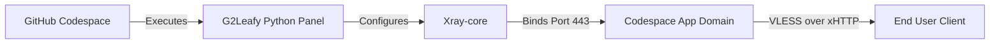

<div align="center">

# G2rayXCodeLeafy

A sleek VLESS proxy manager for GitHub Codespaces.

[](https://github.com/Code-Leafy/G2rayXCodeLeafy)
[](https://github.com/Code-Leafy/G2rayXCodeLeafy)
[]()

</div>

---

<div align="center">

<!-- 🎬 Quick Start Tutorial Video -->
https://github.com/user-attachments/assets/79174a4a-ef86-4c1d-9f1a-909d0b29a248

<br>

<!-- 📸 Panel Preview Image -->


</div>

<br>

## Overview

G2ray is a powerful, interactive **Python curses panel** designed to instantly deploy and manage Xray VLESS XHTTP configurations. Built specifically for the GitHub Codespaces environment, it automates port management, traffic monitoring, and connection keep-alives natively.

> **Note:** The panel includes an advanced background anti-sleep engine to prevent your free-tier Codespace from hibernating while the proxy is in use.

---

<summary><kbd>🔗</kbd> Community Donated Configs (SUB)</summary>

Want to use public nodes donated by other G2ray users? Import this subscription link directly into your V2ray/Xray client:

```text
https://raw.githubusercontent.com/Code-Leafy/G2rayXCodeLeafy/main/configs.txt
```

---

### Core Features

#### ⚡ One-Click Deploy & Manage
Generate and start Xray engines in seconds. The beautiful TUI (Terminal User Interface) makes managing nodes and viewing live config links effortless. 

#### 🔄 Smart Auto-Keepalive
Built-in background threads prevent GitHub Codespaces from shutting down due to inactivity by constantly pinging the sub-port and simulating TTY activity, keeping your tunnel open.

#### 📡 Live Analytics & Quota
Tracks real-time RX/TX data consumption and actively monitors resource usage (CPU/RAM). It accurately estimates your remaining 60-hour free-tier quota.

#### 📦 Community Config Network
Donate your generated config directly from the panel to share access with the community securely, without impacting your own speed or exposing personal data.

<div align="center">

| 🛠️ Configuration Optimizer |
| :--- |
| To finalize your setup, take the config received from the panel and visit **[NetLeafy](https://code-leafy.github.io/NetLeafy)**. Set the server mode to **G2ray** and paste your link to generate a fully optimized connection. |

</div>

---

## 🚀 Quick Start (5 Platforms)

Choose your platform below. For all CLI methods, the panel (`g2leafy.py`) is configured to **auto-start** immediately once you SSH into the Codespace!

### 🌐 1. GitHub Codespaces (Browser / VSCode)
*No local installation required.*
1. **Fork the Repository**: Click **Fork** at the top-right of this GitHub page.
2. **Create a Codespace**: Open your fork → Click the green **Code** button → **Codespaces** tab → **Create codespace on main**.
3. **Wait for Environment**: Allow 1-2 minutes for the container to build.
4. **Launch Panel**: The `g2leafy.py` panel will automatically launch in the integrated VS Code terminal!

---

### 🪟 2. Windows Terminal
1. **Install GitHub CLI**: Open Terminal and run:
   ```powershell
   winget install --id GitHub.cli
   ```
2. **Login**: 
   ```powershell
   gh auth login
   ```
3. **Fork the Repo**: 
   ```powershell
   gh repo fork Code-Leafy/G2rayXCodeLeafy --clone=false
   ```
4. **Create & Connect**: 
   ```powershell
   gh codespace create -R <your-username>/G2rayXCodeLeafy
   gh codespace ssh
   ```

---

### 🐧 3. Linux
1. **Install GitHub CLI**:
   ```bash
   # Debian/Ubuntu
   curl -fsSL https://cli.github.com/packages/githubcli-archive-keyring.gpg | sudo dd of=/usr/share/keyrings/githubcli-archive-keyring.gpg
   echo "deb [arch=$(dpkg --print-architecture) signed-by=/usr/share/keyrings/githubcli-archive-keyring.gpg] https://cli.github.com/packages stable main" | sudo tee /etc/apt/sources.list.d/github-cli.list > /dev/null
   sudo apt update && sudo apt install gh -y
   ```
2. **Login**: 
   ```bash
   gh auth login
   ```
3. **Fork the Repo**: 
   ```bash
   gh repo fork Code-Leafy/G2rayXCodeLeafy --clone=false
   ```
4. **Create & Connect**: 
   ```bash
   gh codespace create -R <your-username>/G2rayXCodeLeafy
   gh codespace ssh
   ```

---

### 🍎 4. macOS
1. **Install GitHub CLI**: Open Terminal and run:
   ```bash
   brew install gh
   ```
2. **Login**: 
   ```bash
   gh auth login
   ```
3. **Fork the Repo**: 
   ```bash
   gh repo fork Code-Leafy/G2rayXCodeLeafy --clone=false
   ```
4. **Create & Connect**: 
   ```bash
   gh codespace create -R <your-username>/G2rayXCodeLeafy
   gh codespace ssh
   ```

---

### 📱 5. Termux (Android)
1. **Update & Install Packages**: Open Termux and run:
   ```bash
   pkg update -y && pkg install gh openssh -y
   ```
2. **Login**: 
   ```bash
   gh auth login
   ```
3. **Fork the Repo**: 
   ```bash
   gh repo fork Code-Leafy/G2rayXCodeLeafy --clone=false
   ```
4. **Create & Connect**: 
   ```bash
   gh codespace create -R <your-username>/G2rayXCodeLeafy
   gh codespace ssh
   ```

---

## Usage

When launched, the panel provides a sleek graphical terminal UI (TUI). 
* Use your keyboard's **Arrow Keys (↑/↓)** or **Tab** to navigate between tabs (Dashboard, Settings, Config Gen, Logs).
* Follow the on-screen key hints at the bottom left (e.g., press `[s]` to start the engine, `[x]` to stop, `[a]` to add configs).

```bash
# If the panel does not show up automatically for any reason, run:
python3 g2leafy.py
```

---

## Architecture



<details>
<summary><kbd>📁</kbd> Project Structure</summary>

```text
G2rayXCodeLeafy/
├── data/                    # Dynamic storage for usage stats, UUIDs, & configs
├── logs/                    # Xray engine error logs
├── assets/                  # Media resources (previews & videos)
├── configs.txt              # Community donated subscription configs
└── g2leafy.py               # The main interactive Python curses engine
```

</details>

---

<details>
<summary><kbd>❓</kbd> FAQ & Troubleshooting</summary>

**My Codespace keeps shutting down?**
Ensure you have activated **Wake Lock** (Press `3` in the Settings tab of the panel) to spawn a background keep-alive pulse that simulates activity.

**Why are my speeds slow?**
For optimal routing, always try to ensure your GitHub Codespace region is set to `Europe West` in your GitHub account settings, as this places the server in NL/DE.

</details>

<br>

<div align="center">

> **⚠️ Educational Purpose Only:** This project is provided for educational and research purposes. Users are solely responsible for compliance with all local laws. The developer assumes no liability for misuse.

[MIT License](https://github.com/Code-Leafy/G2rayXCodeLeafy/blob/main/LICENSE) · Crafted by [Code-Leafy](https://github.com/Code-Leafy)
</div>
